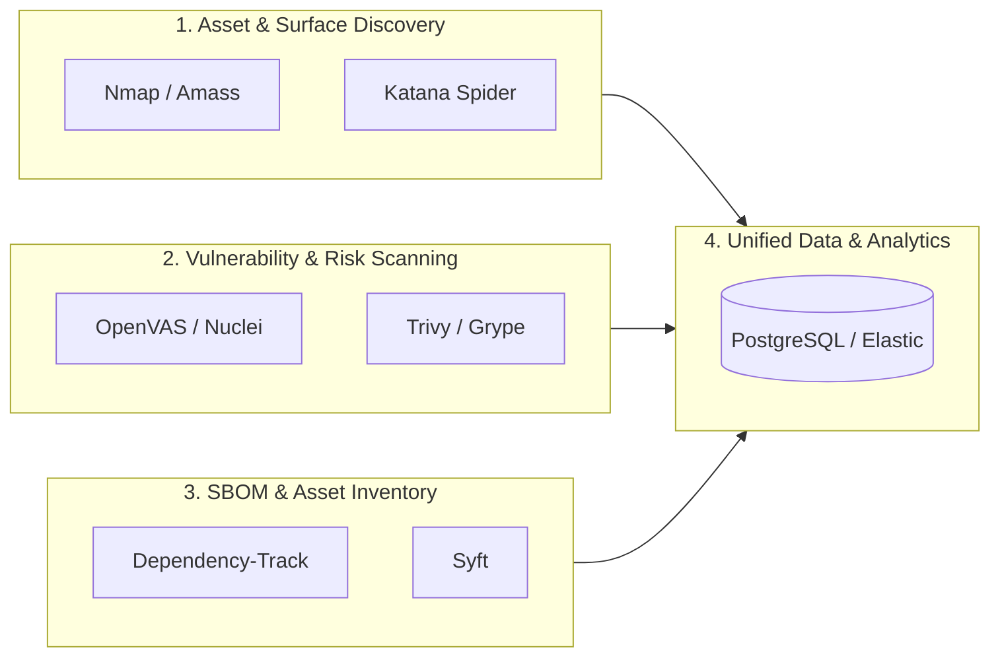

# 🛡️ Awesome Exposure Management Platform Ecosystem

  

  
  
  
  
  
  

  <i>Read this in other languages: <a href="README_zh-CN.md">🌐 简体中文</a></i>

---

## 📌 Overview & SEO Insights

Welcome to the ultimate curated directory of **Continuous Threat Exposure Management (CTEM)**, **External Attack Surface Management (EASM)**, **Cyber Asset Attack Surface Management (CAASM)**, and **Vulnerability Prioritization & Remediation** tools.

This repository tracks top enterprise **SaaS platforms** and **open-source GitHub security tools** designed to help SOC teams, security architects, CISOs, and vulnerability management leads discover, prioritize, and remediate security risks across cloud, on-premises, and code environments.

---

## 📑 Table of Contents

- [📊 SaaS & Managed Platforms](#-saas--managed-platforms)
- [🔓 Open-Source GitHub Projects](#-open-source-github-projects)
- [🛠️ Building a Custom Exposure Management Pipeline](#%EF%B8%8F-building-a-custom-exposure-management-pipeline)
- [🤝 How to Contribute](#-how-to-contribute)
- [☕ Support & Sponsorship](#-support--sponsorship)
- [⚠️ Disclaimer](#%EF%B8%8F-disclaimer)
- [📈 Star History](#-star-history)

---

## 📊 SaaS & Managed Platforms

> 💡 **Market Overview & Structure:** The Continuous Threat Exposure Management (CTEM) and Cyber Exposure Management market is estimated at **$5.2 Billion (2025/2026)** and projected to reach **~$12.8 Billion by 2030** (CAGR ~19.5%). The market is currently **moderately fragmented**, with hyperscalers and cybersecurity titans (Palo Alto Networks, Microsoft, Tenable, Wiz) competing alongside high-growth CAASM and attack surface management specialists (Axonius, Armis, runZero).

*Note: The table below is sorted in descending order by company scale (Valuation / Market Capitalization).*

| Platform | Market Scale / Valuation | Starting Tier Price | Free Tier / Trial Limit | Key Features & Capabilities |
| :--- | :--- | :--- | :--- | :--- |
| **[Microsoft Security Exposure Management](https://www.microsoft.com/)** | **~$3.1 Trillion** (Market Cap) | $15.00/user/month (Microsoft Defender for Endpoint P2) | **90-Day Free Trial** (Microsoft Defender XDR evaluation with full enterprise features) | Built on an **Enterprise Exposure Graph** to map attack paths, detect sensitive database risks, and protect privileged identity paths automatically. |
| **[Palo Alto Cortex Exposure Management](https://www.paloaltonetworks.com/)** | **~$110 Billion** (Market Cap) | $112.00/endpoint/year (Cortex XDR Pro baseline) | **30-Day Free Trial** (Hands-on lab / trial environment available via Cortex portal) | Unifies Palo Alto sensors (Cortex Agent, ASM, Network Scanner) with 3rd-party scanners (Qualys, Rapid7, Tenable). |
| **[Wiz](https://www.wiz.io/)** | **~$12 Billion** (Valuation) | $15,000/year (Base platform subscription tier) | **30-Day Free Trial** (Interactive cloud environment demo with full Wiz Security Graph access) | Cloud security platform featuring unified **UVM** and **ASM** powered by the Wiz Security Graph with code-to-cloud attack path correlation. |
| **[Tenable One](https://www.tenable.com/)** | **~$4.8 Billion** (Market Cap) | $3,375/year (Tenable Vulnerability Management 65-asset bundle) | **30-Day Free Trial** (Includes up to 100 IP asset scans and Tenable One dashboard features) | AI-driven exposure management platform unifying assets, vulnerabilities, and attack surface data with custom risk dashboards. |
| **[Armis](https://www.armis.com/)** | **~$4.3 Billion** (Valuation) | $10,000/year (Armis Centrix starter deployment package) | **30-Day Free Trial** (Armis Centrix agentless risk assessment for up to 1,000 devices) | AI-powered asset intelligence engine covering IT, IoT, IoMT, OT, cloud, and mobile assets with real-time risk scoring and deduplication. |
| **[Qualys TotalCloud](https://www.qualys.com/)** | **~$4.2 Billion** (Market Cap) | $1,995/year (Qualys Enterprise TruRisk base package) | **30-Day Free Trial** (Qualys TotalCloud CNAPP & TruRisk Insights trial environment) | CNAPP platform delivering TruRisk Insights, **Attack Path Analysis**, and no-code QFlow remediation playbooks. |
| **[Rapid7 Exposure Command](https://www.rapid7.com/)** | **~$2.4 Billion** (Market Cap) | $2,125/year (InsightVM starter license for 256 assets) | **30-Day Free Trial** (Full access to Rapid7 Exposure Command / InsightVM features) | End-to-end vulnerability and exposure management platform featuring **Remediation Hub**, compensating control evaluation, and 275+ integrations. |
| **[Axonius](https://www.axonius.com/)** | **~$2.6 Billion** (Valuation) | $12,000/year (Axonius Cyber Asset Management starter pack) | **30-Day Free Trial** (Full functional trial for up to 500 connected assets and SaaS apps) | Asset cloud platform aggregating 1,000+ data sources into a unified asset model for Cyber Assets, SaaS Apps, Identities, and Exposures. |
| **[runZero](https://www.runzero.com/)** | **~$500 Million** (Valuation) | $6,000/year (Enterprise tier starting at 1,000 assets) | **Free Forever** (Community Edition free for up to 256 assets) | Cyber Asset Attack Surface Management (CAASM) with uncredentialed network discovery, outlier scoring (0-5), and asset finding aggregation. |
| **[Noetic Cyber](https://www.noeticcyber.com/)** | **~$150 Million** (Valuation) | $15,000/year (Noetic CAASM base platform subscription) | **30-Day Free Trial** (Guided POC / 30-day sandbox environment for asset mapping) | CAASM platform synthesizing multi-source data to map asset exposure, integrating with Lansweeper to automate prioritized remediation. |

---

## 🔓 Open-Source GitHub Projects

Below is a curated list of open-source tools for building exposure management, attack surface discovery, and vulnerability management systems.

*Note: Sorted in descending order by GitHub Stars_Count.*

- **[Trivy](https://github.com/aquasecurity/trivy)**  🌟 `38,090 stars`  
  Comprehensive and versatile security scanner for container images, file systems, Git repositories, AWS accounts, and Kubernetes clusters.

- **[Nuclei](https://github.com/projectdiscovery/nuclei)**  🌟 `31,563 stars`  
  Fast and customizable template-based vulnerability scanner developed by ProjectDiscovery. Powered by a community-driven repository covering CVEs, misconfigurations, and exposed panels.

- **[Masscan](https://github.com/robertdavidgraham/masscan)**  🌟 `26,042 stars`  
  TCP port scanner that transmits SYN packets asynchronously, capable of scanning the entire Internet in under 6 minutes.

- **[Katana](https://github.com/projectdiscovery/katana)**  🌟 `17,581 stars`  
  Next-generation web crawling and spidering framework designed to discover web application endpoints and hidden assets for web attack surface discovery.

- **[OWASP ZAP](https://github.com/zaproxy/zaproxy)**  🌟 `15,836 stars`  
  World's most widely used web application vulnerability scanner for Dynamic Application Security Testing (DAST).

- **[OWASP Amass](https://github.com/owasp-amass/amass)**  🌟 `15,231 stars`  
  In-depth attack surface mapping and domain discovery tool that performs active and passive reconnaissance on DNS infrastructure and external network assets.

- **[Nmap](https://github.com/nmap/nmap)**  🌟 `13,678 stars`  
  The de facto standard for network discovery and port scanning, supporting host discovery, OS fingerprinting, and service detection.

- **[Grype](https://github.com/anchore/grype)**  🌟 `12,936 stars`  
  Vulnerability scanner for container images and filesystems that pairs with SBOM generation tools to detect exposed dependencies.

- **[Syft](https://github.com/anchore/syft)**  🌟 `9,617 stars`  
  CLI tool and Go library for generating a Software Bill of Materials (SBOM) from container images and filesystems.

- **[OpenVAS Scanner](https://github.com/greenbone/openvas-scanner)**  🌟 `4,837 stars`  
  Full-featured open-source network vulnerability scanner (Greenbone Community Edition) featuring 50,000+ vulnerability tests.

- **[OWASP Dependency-Track](https://github.com/DependencyTrack/dependency-track)**  🌟 `4,239 stars`  
  Software Supply Chain Component Analysis platform that monitors Software Bill of Materials (SBOM) for known vulnerabilities.

- **[XORCISM](https://github.com/XORCISM-AI/XORCISM)**  🌟 `84 stars`  
  Unified Open-Source Exposure Management Platform aligning with NIST CSF 2.0 governance, offering AI-assisted pentesting and fused exposure scores (`/api/v1/exposures`).

---

## 🛠️ Building a Custom Exposure Management Pipeline

You can assemble a customized, self-hosted exposure management pipeline by chaining open-source modules:

1. **Asset & Surface Discovery:** Deploy **Nmap** and **OWASP Amass** for continuous external reconnaissance.
2. **Web Exposure:** Utilize **Katana** for endpoint and API parameter discovery.
3. **Vulnerability Assessment:** Run **OpenVAS** for network infrastructure and **Nuclei** for fast CVE/misconfiguration scanning.
4. **Supply Chain & Code Exposure:** Combine **Syft** (SBOM generation) with **Grype** / **Dependency-Track** and **Trivy** for container/file risk analysis.
5. **Unified Data Layer:** Store findings into **PostgreSQL** or **Elasticsearch** for search and custom risk dashboarding.

---

## 🤝 How to Contribute

Contributions are welcome! Please follow these steps to add or update projects:

1. Fork the repository.
2. Edit `README.md` following the existing markdown table or list format.
3. Provide factual descriptions, official links, and accurate Stars_Count / pricing data.
4. Submit a Pull Request with a clear summary of your updates.

If you find this repository helpful, please consider giving it a ⭐!

---

## ☕ Support & Sponsorship

Thank you for visiting and using this awesome resource! If you find this repository valuable for your security team, project, or research, please consider supporting the project:

- 🌟 **Star** this repository to help others discover it.
- 🔀 **Fork** and contribute new tools or updates.
- 📢 **Share** it with your security colleagues and network.
- 💖 **Sponsor / Buy me a coffee:** Show your support on the [GitHub Sponsor Dashboard](https://github.com/sponsors/ishandutta2007).

---

## ⚠️ Disclaimer

- This is a **community-curated list** for educational, research, and informational purposes. It does not constitute an endorsement.
- Exposure management platforms interact with sensitive asset data and vulnerability details; ensure appropriate authorization, access controls, and security posture.
- **Open-Source Note:** While specialized discovery tools are mature, unified open-source exposure management platforms are still evolving.

---

## 📈 Star History

---

  <b>Built with ❤️ for Security Engineers, SOC Analysts, CISOs, and Security Architects.</b>

